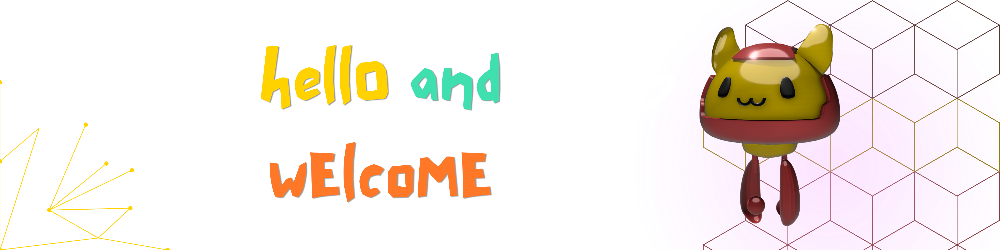

  

##  &nbsp; hola mundo

This is where i share the small fun projects i build for myself, and break them down so anyone can follow along. 

##  &nbsp; projects

each folder has its own setup guide with technical details in its respective readme. try forking/copying the code, and playing around with it. feel free to dm me with feedback and/or other episode topics you want to see!

|   | project | description |
|----|---------|--------------|
|  | [`gcal-declutterer`](./gcal-declutterer) | auto-fades past google calendar events to gray so the weekend feels closer |
|  | [`pink-terminal`](./pink-terminal) |  making your terminal prettier than you ever thought possible |
|  | [`ig-unfollows`](./ig-unfollows) |  finding out who unfollowed you and didn't remove you from their following |

*more coming soon!!!*

##  &nbsp; kudos

feel free to copy, fork, and share (star this repo while you're at it, hehe). if you make a video with it, tag me! and if you remix the code in your own project, a quick credit in the file is appreciated.
-  &nbsp; [`@cocopuffffffffs`](https://tiktok.com/@cocopuffffffffs)
-  &nbsp; [`@cocohdzz`](https://instagram.com/cocohdzz)